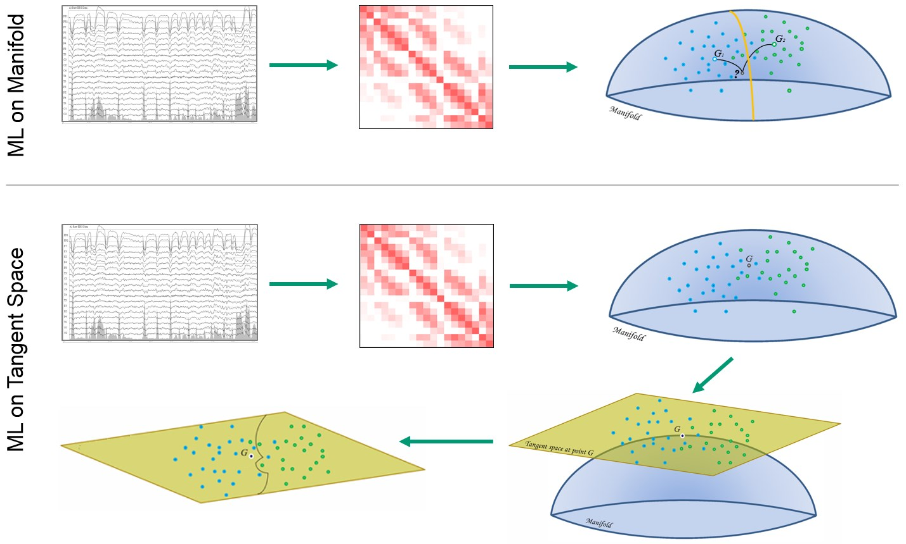

# PosDefManifoldML Documentation

## Requirements & Installation

**Julia**: version ≥ 1.1.1

**Packages**: see the [dependencies](@ref) of the main module.

The package is still not registered. To install it,
execute the following command in Julia's REPL:

    ]add https://github.com/Marco-Congedo/PosDefManifoldML.jl

### Disclaimer

This package is still in a pre-release stage.
Independent reviewers for both the code and the documentation is welcome.

## About the Authors

[Marco Congedo](https://sites.google.com/site/marcocongedo), corresponding
author, is a research scientist of [CNRS](http://www.cnrs.fr/en) (Centre National de la Recherche Scientifique), working in [UGA](https://www.univ-grenoble-alpes.fr/english/) (University of Grenoble Alpes).

**Contact**: first name dot last name at gmail dot com

Saloni Jain is a student at the
[Indian Institute of Technology, Kharagpur](http://www.iitkgp.ac.in/), India.

## Overview

**Riemannian geometry** studies smooth manifolds, multi-dimensional curved spaces with peculiar geometries endowed with non-Euclidean metrics. In these spaces Riemannian geometry allows the definition of **angles**, **geodesics** (shortest path between two points), **distances** between points, **centers of mass** of several points, etc.

In several fields of research such as *computer vision* and *brain-computer interface*, treating data in the **manifold of positive definite matrices** has allowed the introduction of machine learning approaches with remarkable characteristics, such as simplicity of use, excellent classification accuracy, as demonstrated by the [winning score](http://alexandre.barachant.org/challenges/) obtained in six international data classification competitions, and the ability to operate transfer learning (Congedo et *al.*, 2017a, Brachant et *al.*, 2012)[🎓](@ref).

In this package we are concerned with making use of Riemannian Geometry for classifying data in the form of positive definite matrices (e.g.,
[covariance matrices](https://github.com/mateuszbaran/CovarianceEstimation.jl), [Fourier cross-spectral matrices](https://marco-congedo.github.io/FourierAnalysis.jl/dev/crossspectra/
), etc.).
This can be done in two ways: either directly in the **manifold of positive definite matrices** using Riemannian machine learning methods or in the **tangent space**, where traditional (Euclidean) machine learning methods apply
(*i.e.*, linear discriminant analysis, support-vector machine,
logistic regression, random forest, etc.).


**Figure 1**

*Schematic representation of Riemannian classification. Data points are either natively positive definite matrices or are converted into this form. The classification can be performed by Riemannian methods in the manifold of positive definite matrices or by Euclidean methods after projection onto the tangent space.*

For a formal introduction to the manifold of positive definite matrices
the reader is referred to the monography written by Bhatia(2007)[🎓](@ref).

For an introduction to Riemannian geometry and an overview of mathematical tools implemented in the [PostDefManifold](https://marco-congedo.github.io/PosDefManifold.jl/latest/) package, which is heavily used here, see [Intro to Riemannian Geometry](https://marco-congedo.github.io/PosDefManifold.jl/latest/introToRiemannianGeometry/).

### Code units

**PosDefManifoldML** is light-weight. It includes five code units (.jl files):

| Unit   | Description |
|:----------|:----------|
| [MainModule](@ref) | Main module, declaring constants and types |
| [tools.jl](@ref) | Unit containing general tools useful for machine learning and internal functions|
| [mdm.jl](@ref) | Unit implementing the MDM( Minimum Distance to Mean) machine learning model |
| [enlr.jl](@ref) | Unit implementing the ENLR( Elastic Net Logistic Regression) model, including the LASSO and RIDGE LR |
| [cv.jl](@ref)| Unit implementing cross-validation procedures |


## 🎓

**References**

A. Barachant, S. Bonnet, M. Congedo, C. Jutten (2012)
[Multi-class Brain Computer Interface Classification by Riemannian Geometry](https://hal.archives-ouvertes.fr/hal-00681328/document),
IEEE Transactions on Biomedical Engineering, 59(4), 920-928.

A. Barachant, S. Bonnet, M. Congedo, C. Jutten (2013)
[Classification of covariance matrices using a Riemannian-based kernel for BCI applications](https://hal.archives-ouvertes.fr/hal-00820475/document), Neurocomputing, 112, 172-178.

R. Bhatia (2007)
Positive Definite Matrices,
Princeton University press.

M. Congedo, A. Barachant, R. Bhatia R (2017a)
[Riemannian Geometry for EEG-based Brain-Computer Interfaces; a Primer and a Review](https://bit.ly/2HOk5qN),
Brain-Computer Interfaces, 4(3), 155-174.

M. Congedo, A. Barachant, E. Kharati Koopaei (2017b) [Fixed Point Algorithms for Estimating Power Means of Positive Definite Matrices](https://bit.ly/2HKEcGk),
IEEE Transactions on Signal Processing, 65(9), 2211-2220.

**Resources on GLMNet**

[webinar by Trevor Hastie](https://www.youtube.com/watch?v=BU2gjoLPfDc&feature=youtu.be)

[Glmnet vignette](https://web.stanford.edu/~hastie/Papers/Glmnet_Vignette.pdf)

[Glmnet in R, documentation](https://cran.r-project.org/web/packages/glmnet/glmnet.pdf)

[Julia wrapper for GLMNet](https://github.com/JuliaStats/GLMNet.jl)

[A more advanced wrapper for GLMNet](https://github.com/linxihui/GLMNet.jl)

## Contents

```@contents
Pages = [       "index.md",
								"tutorials.md",
                "MainModule.md",
                "mdm.md",
                "enlr.md",
								"cv.md",
								"tools.md",
		]
Depth = 1
```

## Index

```@index
```
